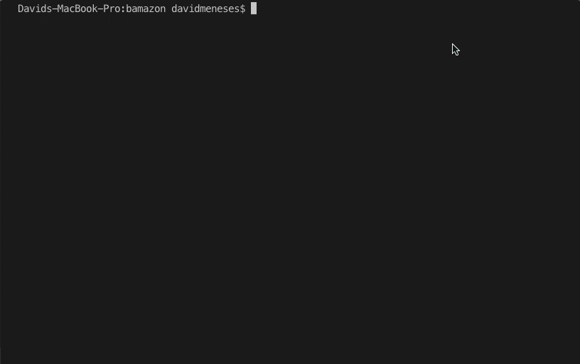

# Bamazon

## Description

This project is a light, Amazon shopping clone. Included right now is only the customer side where the customer is able to:

- See the name, price and quantity of items in stock
- Select an item to purchase
- Select how many of the item to purchase
- See the updated inventory numbers,
- Choose to exit or shop again.

## Example

Here you see me starting the app, make a purchase, choose to continue shopping, viewing up the updated inventory, making a second purchase, then exiting the app.

## Technologies Used

- Node
- MAMP & MySQL
- Inquirer & MySQL NPM Packages

## Setting Up A Server

To be able to run the app the user must first have a database set up. I chose MySQL. Inside of MySQL you would first run the commands in the schema.sql file to create the database, then populate the inventory with the data in the seeds.sql.

## Running The App

After the database is set up the user then needs to install the Inquirer and MySQL npm packages. First the user must type "innit -y" in their terminal and press enter. Then in the terminal the user will type "npm i inquirer mysql". This will install the packages necessary to run the program. Lastly, start the program by typing "node bamazonCustomer.js" in their terminal and pressing enter to begin shopping.

Changes

doing more changes
